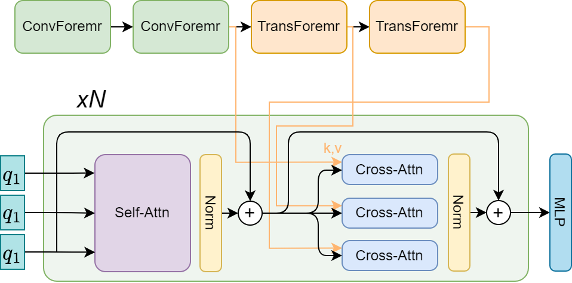

# Files explanation:
## Usage:
Training: 
```
!torchrun --standalone --nnodes=1 --nproc-per-node=8 train_ca_ac_good.py --batch_size 10 --save_step 5000 --xformers False --log_step 500
```
Inference:
```
!python demo_ca_find_thrd.py --data test_dataset --ckpt models/caformer_m36-mAP45.ckpt --general_thr .99 --characters_thr .70
```
Gradio Demo: 
```
!python gradio_demo_test.py
```

## In Active Use:
- **demo_ca.py**: Inference for caformer-mld.
- **demo_ca_gradio.py**: Gradio-adjusted demo
- **train_ca_ac.py**: Training file for our model, essentially a wrapper for `train_ac.py`.
- **train_ac.py**: The main body of training code, originally designed for tresnet.
- **gradio_demo_launcher.py**: Gradio demo starter code. Just run !python gradio_demo_test.py to start
- **test_dataset**: A small demo dataset consisting of 20 images, featuring both common and uncommon subjects.
- **test.ipynb**: A notebook used for executing Python files and checking the environment.
- **sematics_test.ipynb**: Another notebook used for running Python files and environment checks.


## Path to Danbooru metadata
s3://pixai-test-uw2/richard/final_Danbooru_5.parquet

## Path to model checkpoints
s3://pixai-test-uw2/richard/mld-ckpts/records/

## Path to tag-index dictionary
s3://pixai-test-uw2/richard/tags_index_dict.parquet


## Not in active use:
demo.py: Inference for tresnet-mld (not used)
class.json


# ML-Danbooru: Anime image tags detector

## Introduction
An anime image tag detector based on modified [ML-Decoder](https://github.com/Alibaba-MIIL/ML_Decoder).
Model trained with cleaned [danbooru2021](https://gwern.net/danbooru2021).

+ Designed a new TResNet-D structure as backbone to enhance the learning of low-level features.
+ Replace the ReLU in backbone with [FReLU](https://arxiv.org/pdf/2007.11824.pdf).
+ Using learnable queries for transformer decoder.

## Model Structure



## Model-Zoo
https://huggingface.co/7eu7d7/ML-Danbooru

## Usage
Download the model and run below command:
```bash
python demo.py --data <path to image or directory> --model_name tresnet_d --num_of_groups 32 --ckpt <path to ckpt> --thr 0.7 --image_size 640 
```

Keep the image ratio invariant:
```bash
python demo.py --data <path to image or directory> --model_name tresnet_d --num_of_groups 32 --ckpt <path to ckpt> --thr 0.7 --image_size 640 --keep_ratio True
```

### ML_CAFormer
```bash
python demo_ca.py --data <path to image or directory> --model_name caformer_m36 --ckpt <path to ckpt> --thr 0.7 --image_size 448
```